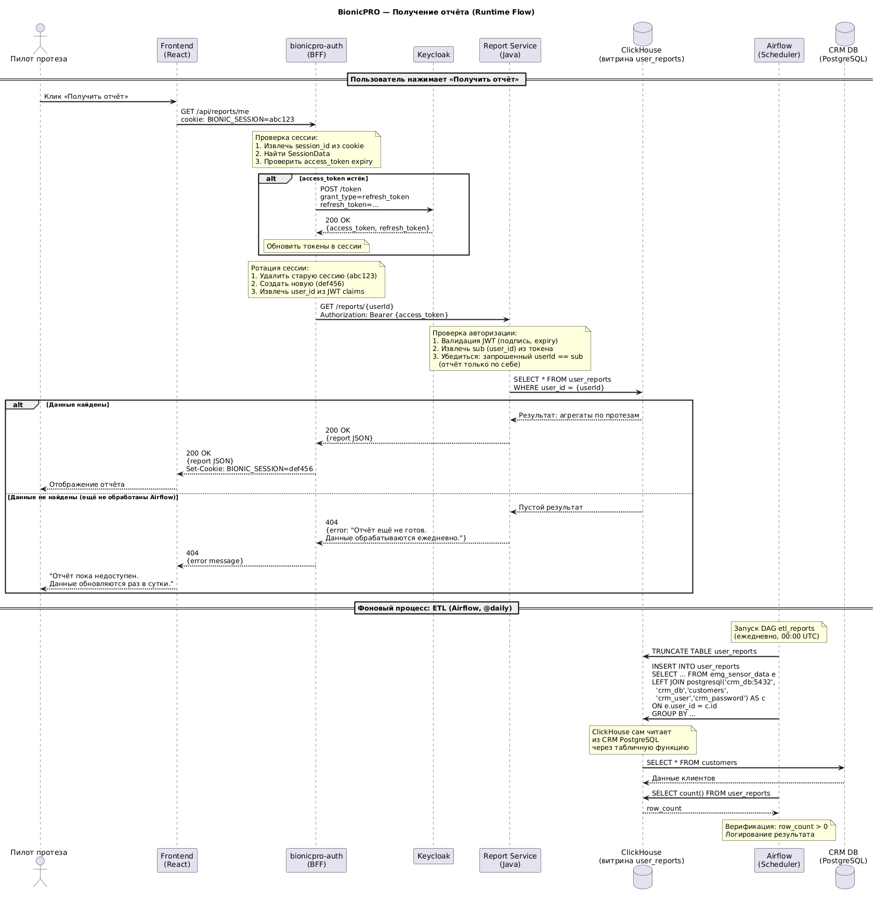
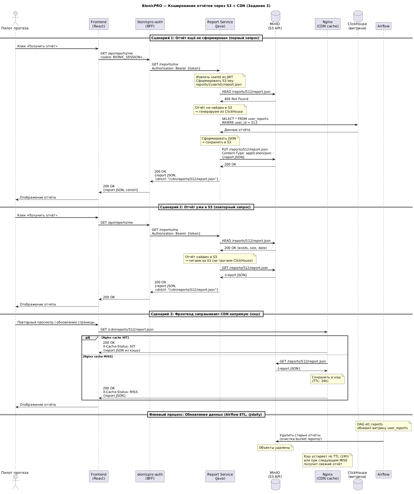

# BionicPRO — Спринт 9: SSO + OLAP + CDC

> Проектная работа 9 спринта курса "Архитектор ПО PRO"

## Обзор

В этом спринте решаем четыре задачи:

| # | Задание | Суть | Статус |
|---|---------|------|--------|
| 1 | Повышение безопасности | BFF + PKCE + LDAP + MFA + Яндекс ID | ✅ Готово |
| 2 | Сервис отчётов | Airflow ETL → ClickHouse → Report API | ✅ Готово |
| 3 | Снижение нагрузки на БД | S3 + CDN (Nginx) кэширование отчётов | ✅ Готово |
| 4 | Оперативность CRM | CDC через Debezium → Kafka → ClickHouse | ⏳ |

## Структура репозитория

```
architecture-bionicpro/
├── bionicpro-auth/          ← Задание 1: BFF-сервис (Java 25, Javalin)
│   ├── pom.xml
│   ├── Dockerfile
│   └── src/main/java/bionicpro/auth/
│       ├── AuthServer.java              ← Точка входа, роутинг, конфиг из env
│       ├── handler/
│       │   ├── LoginHandler.java        ← GET /auth/login (PKCE + redirect)
│       │   ├── CallbackHandler.java     ← GET /auth/callback (token exchange)
│       │   ├── LogoutHandler.java       ← POST /auth/logout
│       │   └── ProxyHandler.java        ← GET/POST /api/** (session + proxy)
│       ├── session/
│       │   ├── SessionStore.java        ← Interface (→ Redis в проде)
│       │   ├── InMemorySessionStore.java← ConcurrentHashMap + cleanup
│       │   └── SessionData.java         ← Record: tokens + user info
│       ├── keycloak/
│       │   └── KeycloakClient.java      ← Token exchange, refresh, JWT parse
│       └── util/
│           ├── PkceUtil.java            ← code_verifier / code_challenge / SecureRandom ID
│           └── CookieUtil.java          ← HttpOnly + SameSite=Strict cookies
├── report-service/          ← Задание 2+3: Report API + S3 кэш (Java 25, Javalin)
│   ├── pom.xml
│   ├── Dockerfile
│   └── src/main/java/bionicpro/reports/
│       ├── ReportServer.java            ← Точка входа, порт 8001, конфиг из env
│       ├── handler/
│       │   ├── ReportHandler.java       ← GET /reports/me + /reports/{userId} + S3 кэш
│       │   └── HealthHandler.java       ← GET /health (CH + S3 статус)
│       ├── clickhouse/
│       │   └── ClickHouseClient.java    ← HTTP-запросы к ClickHouse (java.net.http)
│       ├── s3/
│       │   └── S3ReportStore.java       ← MinIO: check/get/put отчётов, CDN URL
│       └── auth/
│           └── JwtUtil.java             ← Base64-декодер JWT payload
├── airflow/                 ← Задание 2: ETL-оркестрация
│   └── dags/
│       └── etl_reports.py               ← DAG: CRM + телеметрия → витрина ClickHouse
├── olap-db/                 ← ClickHouse: init-скрипты, данные
│   ├── init.sql                         ← emg_sensor_data + user_reports (витрина)
│   ├── olap.csv                         ← Тестовые данные телеметрии (5000 записей)
│   └── users.xml                        ← Конфиг доступа (без пароля, dev)
├── crm-db/                  ← CRM: init-скрипт, данные
│   ├── init.sql                         ← Таблица customers
│   └── crm.csv                          ← Тестовые данные клиентов (1000 записей)
├── frontend/                ← Обновлённый фронтенд (без keycloak-js)
│   ├── src/
│   │   ├── App.tsx                      ← Убран ReactKeycloakProvider
│   │   └── components/
│   │       └── ReportPage.tsx           ← Кнопка «Получить отчёт», отображение данных
│   └── package.json                     ← Удалены keycloak-js, @react-keycloak/web
├── keycloak/
│   ├── realm-export.json                ← Исходный конфиг (не трогаем)
│   └── keycloak-results-export.json     ← Наш результат (BFF + PKCE + LDAP + MFA + Яндекс)
├── ldap/
│   └── config.ldif                      ← Исправлен баг uid=alex → uid=alex.johnson
├── diagrams/                ← PlantUML-диаграммы
│   ├── C4_BionicPRO_Target.puml / .png
│   ├── Auth_Login_Flow.puml / .png
│   ├── Auth_API_Request_Flow.puml / .png
│   ├── Auth_Logout_Flow.puml / .png
│   ├── ETL_Reports_Architecture.puml / .png
│   ├── Report_Request_Flow.puml / .png
│   └── S3_CDN_Cache_Flow.puml / .png
├── nginx/                   ← Задание 3: CDN — Nginx reverse proxy + cache
│   └── nginx.conf                       ← proxy_cache → MinIO, TTL 24h, X-Cache-Status
├── debezium/                ← Задание 4: CDC connector config
├── docker-compose.yaml      ← Полная конфигурация развёртывания
└── README.md                ← Этот файл
```

---

## Задание 1. Повышение безопасности системы

### Проблема

Исходная архитектура использовала OAuth 2.0 Code Grant напрямую из фронтенда (`keycloak-js`). Токены (`access_token`, `refresh_token`) хранились в браузере — в `localStorage` или памяти JavaScript. Это привело к взлому: XSS-атака позволила украсть токены и скачать персональные данные пользователей.

### Решение: BFF + PKCE

Внедряем **Backend for Frontend (BFF)** паттерн — новый сервис `bionicpro-auth`, который:

1. Реализует PKCE (Proof Key for Code Exchange) поверх Code Grant
2. Получает и хранит токены **на сервере** (фронтенд их никогда не видит)
3. Выдаёт фронтенду только сессионную cookie (`HttpOnly`, `Secure`, `SameSite=Strict`)
4. Проксирует запросы к API, подставляя `Authorization: Bearer <token>`
5. Автоматически обновляет `access_token` через `refresh_token`
6. Ротирует `session_id` при каждом запросе (защита от session fixation)

### Диаграммы

Все диаграммы — в формате PlantUML (исходники в `diagrams/`). Рендер: https://www.planttext.com/

#### C4 Container Diagram (Target Architecture)

Целевая архитектура после выполнения всех заданий спринта 9.

[Исходник PlantUML](diagrams/C4_BionicPRO_Target.puml)


#### Login Flow (BFF + PKCE + MFA)

Полный flow логина: PKCE → Keycloak (пароль + OTP) → BFF получает токены → создание сессии → HttpOnly cookie.

[Исходник PlantUML](diagrams/Auth_Login_Flow.puml)


#### API Request Flow (Session Rotation + Token Refresh)

Запрос к защищённому ресурсу: проверка сессии → ротация session_id → refresh токена → проксирование к API.

[Исходник PlantUML](diagrams/Auth_API_Request_Flow.puml)


#### Logout Flow

Завершение сессии: удаление серверной сессии → Keycloak SSO logout → очистка куки.

[Исходник PlantUML](diagrams/Auth_Logout_Flow.puml)


### C4 Container Diagram: ключевые изменения

По сравнению с исходной архитектурой:

| Компонент | Было | Стало |
|-----------|------|-------|
| Аутентификация | `keycloak-js` на фронте, токены в браузере | `bionicpro-auth` (BFF), токены на сервере |
| Сессии | Нет серверных сессий | In-Memory `ConcurrentHashMap` (session_id → tokens). В проде → Redis |
| Identity | Keycloak standalone | Keycloak + LDAP (User Federation) + Яндекс ID (Brokering) |
| MFA | Нет | TOTP (Google Authenticator / FreeOTP) |
| Аналитика | PostgreSQL (перегружен) | ClickHouse (OLAP) + витрины |
| Данные | Batch-only | Airflow (batch) + Kafka/Debezium (CDC) |
| Отчёты | Нет | Report Service → S3 → Nginx (CDN cache) |

Все оригинальные компоненты (Программа в чипе протеза, Приложение для донастройки, Интернет-магазин, CRM, cli tool) **сохранены** на диаграмме.

---

### Задача 1.1 — Архитектурное решение

→ `diagrams/C4_BionicPRO_Target.puml`

Целевая C4 Container Diagram включает все существующие компоненты + новые: `bionicpro-auth` (BFF), Session Store, ClickHouse, Airflow, Kafka/Debezium, Report Service, S3/MinIO, Nginx, OpenLDAP, Яндекс ID.

---

### Задача 1.2 — PKCE

→ `diagrams/Auth_Login_Flow.puml` (шаги 4–19)
→ `bionicpro-auth/.../util/PkceUtil.java`
→ `bionicpro-auth/.../handler/LoginHandler.java` + `CallbackHandler.java`

Client `reports-frontend` в Keycloak переведён с `publicClient: true` на **confidential** + PKCE S256:

```json
{
  "clientId": "reports-frontend",
  "publicClient": false,
  "secret": "bff-client-secret-change-me",
  "redirectUris": ["http://localhost:8000/auth/callback"],
  "directAccessGrantsEnabled": false,
  "attributes": { "pkce.code.challenge.method": "S256" }
}
```

`redirect_uri` указывает на BFF (`localhost:8000/auth/callback`), **не** на фронтенд.

PKCE реализация (`PkceUtil.java`):
- `code_verifier` — 32 байта `SecureRandom` → Base64URL (43 символа)
- `code_challenge` — `BASE64URL(SHA-256(code_verifier))`
- `state` — 32 байта `SecureRandom` → hex (64 символа), CSRF-защита

Login flow: `LoginHandler` генерирует PKCE-пару, сохраняет `code_verifier` на сервере (привязанный к `state`), и редиректит пользователя на Keycloak с `code_challenge`. Callback: `CallbackHandler` обменивает `code + code_verifier + client_secret` на токены.

---

### Задача 1.3 — Безопасное хранение токенов (bionicpro-auth)

→ `bionicpro-auth/` — полный исходный код Java-сервиса
→ `diagrams/Auth_API_Request_Flow.puml` (session rotation + token refresh)

**Стек:** Java 25, Javalin 6.4, Jackson, Logback. Maven. Без Spring.

**Эндпоинты:**

| Метод | Путь | Handler | Описание |
|-------|------|---------|----------|
| GET | `/auth/login` | `LoginHandler` | Генерирует PKCE, редиректит на Keycloak |
| GET | `/auth/callback` | `CallbackHandler` | Обменивает code на токены, создаёт сессию, Set-Cookie |
| POST | `/auth/logout` | `LogoutHandler` | Удаляет сессию, Keycloak SSO logout |
| GET/POST | `/api/**` | `ProxyHandler` | Валидация + ротация + refresh + проксирование |
| GET | `/health` | inline | `{"status":"UP","sessions":N}` |

**Безопасность сессий:**
- Session ID — `SecureRandom(32 bytes)` → hex (256 бит энтропии). Не UUID.
- Cookie: `BIONIC_SESSION=<id>; HttpOnly; SameSite=Strict; Path=/; Max-Age=1800`
- Ротация: при каждом запросе `getAndRemove(oldId)` → обработка → `put(newId)`. Атомарно.
- Refresh: `ProxyHandler` проверяет `accessTokenExpiresAt`, вызывает Keycloak `/token` с `grant_type=refresh_token`
- Cleanup: фоновый поток каждые 5 минут удаляет истёкшие сессии

**Хранилище:** `InMemorySessionStore` (`ConcurrentHashMap`) реализует интерфейс `SessionStore`. Замена на Redis — одна имплементация, остальной код не меняется.

**Smoke-тест пройден:**

```bash
$ curl -s http://localhost:8000/health | jq .
{"sessions":0,"status":"UP"}

$ curl -v http://localhost:8000/auth/login 2>&1 | grep "Location"
< Location: http://localhost:8080/realms/reports-realm/.../auth?...&code_challenge=...&code_challenge_method=S256

$ curl -s http://localhost:8000/api/reports/me | jq .
{"error":"Not authenticated. Please login."}
```

---

### Задача 1.4 — LDAP

→ `ldap/config.ldif`
→ `keycloak/keycloak-results-export.json` (секция `components`)

**Исправлен баг** в исходном `config.ldif`: DN записи Alex'а был `uid=alex`, а атрибут `uid` — `alex.johnson`. Группа `prothetic_user` ссылалась на `uid=alex.johnson` → member не находился. Исправлено: `uid=alex.johnson` и в DN, и в атрибуте.

Добавлена группа `administrator` (отсутствовала в оригинале).

Keycloak User Federation настроен на `ldap://openldap:389`:
- Edit Mode: `READ_ONLY`
- Group-to-Role маппинг: LDAP-группы (`cn=prothetic_user,ou=Groups,...`) → Keycloak realm roles
- Attribute mappers: `uid→username`, `mail→email`, `cn→firstName`, `sn→lastName`

---

### Задача 1.5 — MFA (OTP)

→ `keycloak/keycloak-results-export.json` (секции `otpPolicy*`, `requiredActions`, `users[].requiredActions`)

Настройка:
- OTP Policy: TOTP, HmacSHA1, 6 digits, 30 sec, Look Ahead Window = 1
- Required Action `CONFIGURE_TOTP` включён как Default Action
- У всех пользователей в `requiredActions` добавлен `CONFIGURE_TOTP`
- При первом логине Keycloak покажет QR-код для Google Authenticator / FreeOTP

---

### Задача 1.6 — Яндекс ID

→ `keycloak/keycloak-results-export.json` (секция `identityProviders`)

Identity Provider настроен как OpenID Connect:
- Authorization URL: `https://oauth.yandex.ru/authorize`
- Token URL: `https://oauth.yandex.ru/token`
- UserInfo URL: `https://login.yandex.ru/info`
- Scope: `login:email login:info`
- `clientId` / `clientSecret` — плейсхолдеры (`YANDEX_CLIENT_ID_PLACEHOLDER`). Для активации необходимо зарегистрировать приложение на https://oauth.yandex.ru/ и подставить реальные значения.

---

### Изменения во фронтенде

Из `package.json` удалены зависимости:
- `keycloak-js` (^21.1.0)
- `@react-keycloak/web` (^3.4.0)

`App.tsx` — убран `ReactKeycloakProvider`, чистый рендер без знания о Keycloak.

`ReportPage.tsx` — полностью переписан:

| Аспект | Было (keycloak-js) | Стало (BFF) |
|--------|---------------------|-------------|
| Логин | `keycloak.login()` | `window.location.href = '/auth/login'` |
| Токен | `keycloak.token` в `Authorization` header | `credentials: 'include'` (cookie автоматически) |
| Логаут | `keycloak.logout()` | `POST /auth/logout` (form submit) |
| Знание о Keycloak | Да (URL, realm, clientId) | Нет. Фронтенд знает только BFF URL |

---

### Изменения в docker-compose.yaml

- Добавлен сервис `bionicpro-auth` (build из `./bionicpro-auth`, порт 8000)
- Keycloak импортирует `keycloak-results-export.json` (вместо `realm-export.json`)
- Frontend: env vars `REACT_APP_KEYCLOAK_*` заменены на `REACT_APP_BFF_URL`

---

### Deliverables задания 1

- [x] C4 Container Diagram целевой архитектуры (`diagrams/C4_BionicPRO_Target.puml`)
- [x] Sequence Diagram: Login Flow с PKCE + MFA (`diagrams/Auth_Login_Flow.puml`)
- [x] Sequence Diagram: API Request с ротацией и refresh (`diagrams/Auth_API_Request_Flow.puml`)
- [x] Sequence Diagram: Logout Flow (`diagrams/Auth_Logout_Flow.puml`)
- [x] Код PKCE flow (`bionicpro-auth/.../PkceUtil.java`, `LoginHandler.java`, `CallbackHandler.java`)
- [x] Код BFF-сервиса: токены на сервере, HttpOnly cookie, ротация, refresh (`bionicpro-auth/`)
- [x] Обновлённый фронтенд без `keycloak-js` (`frontend/`)
- [x] Keycloak realm config: confidential client + PKCE + LDAP + MFA + Яндекс ID (`keycloak/keycloak-results-export.json`)
- [x] LDAP config с исправленным багом (`ldap/config.ldif`)
- [x] Обновлённый `docker-compose.yaml`
- [ ] Интеграционный тест: полный auth flow (Keycloak + BFF + Frontend). Требует `docker-compose up` и регистрации приложения в Яндекс ID.

---

## Задание 2. Разработка сервиса отчётов

### Проблема

Пользователи хотят получать данные о работе своих протезов в виде отчёта. Данные разбросаны по двум источникам: телеметрия с датчиков (ClickHouse) и информация о клиентах (CRM PostgreSQL). Нужен ETL-процесс для объединения данных и API для выдачи отчётов.

### Решение: Airflow ETL → ClickHouse витрина → Report Service API

Два потока данных:

**ETL (batch, @daily):**
```
CRM PostgreSQL ──┐
                 ├──→ Airflow DAG ──→ ClickHouse (витрина user_reports)
ClickHouse       ┘
(emg_sensor_data)
```

**Runtime (по запросу пользователя):**
```
Frontend → BFF (cookie → Bearer) → Report Service → ClickHouse витрина → JSON
```

### Диаграммы

#### ETL Reports Architecture (C4 Container Diagram)

Архитектура сервиса отчётов: источники данных, ETL через Airflow, витрина ClickHouse, Report Service API.

[Исходник PlantUML](diagrams/ETL_Reports_Architecture.puml)


#### Report Request Flow (Sequence Diagram)

Полный поток запроса отчёта: от клика пользователя через BFF и Report Service до ClickHouse. Включает ETL-процесс Airflow.

[Исходник PlantUML](diagrams/Report_Request_Flow.puml)



---

### Задача 2.1 — Архитектура решения

→ `diagrams/ETL_Reports_Architecture.puml`
→ `diagrams/Report_Request_Flow.puml`

Архитектура включает:
- **Источники:** CRM DB (PostgreSQL, клиенты) + ClickHouse (сырая телеметрия `emg_sensor_data`)
- **ETL:** Apache Airflow, DAG `etl_reports`, расписание `@daily`
- **Витрина:** таблица `user_reports` в ClickHouse (агрегаты по пользователям и типам протезов)
- **API:** Report Service (Java 25, Javalin) — `GET /reports/me`, `GET /reports/{userId}`
- **Авторизация:** BFF проксирует запросы с Bearer token, Report Service проверяет JWT sub == userId

Ключевое решение: Airflow не перекладывает данные через Python. Вместо этого ClickHouse сам читает из CRM PostgreSQL через табличную функцию `postgresql()`. Данные не проходят через промежуточные слои.

---

### Задача 2.2 — Airflow DAG

→ `airflow/dags/etl_reports.py`

**DAG `etl_reports`** — четыре задачи, линейная цепочка:

```
check_sources → truncate_view → build_report_view → verify_view
```

| Задача | Что делает |
|--------|-----------|
| `check_sources` | Проверяет доступность CRM и ClickHouse, считает строки |
| `truncate_view` | Очищает витрину (full refresh) |
| `build_report_view` | `INSERT INTO user_reports SELECT ... FROM emg_sensor_data JOIN postgresql(crm)` |
| `verify_view` | Проверяет, что витрина не пуста, логирует статистику |

**Конфигурация:**
- `schedule_interval='@daily'` — ежедневно в полночь UTC
- `catchup=False` — не запускать за прошлые даты
- `retries=2`, `retry_delay=5 мин`
- Зависимости Python: `clickhouse-driver`, `psycopg2-binary` (через `_PIP_ADDITIONAL_REQUIREMENTS`)

**Стратегия загрузки:** Full refresh (truncate + insert). Для учебного объёма данных это проще и надёжнее инкрементальной загрузки.

---

### Задача 2.2 — ClickHouse: схема данных

→ `olap-db/init.sql`

Две таблицы:

**`emg_sensor_data`** — сырая телеметрия:
```sql
CREATE TABLE emg_sensor_data (
    user_id UInt32, prosthesis_type String, muscle_group String,
    signal_frequency UInt32, signal_duration UInt32,
    signal_amplitude Decimal(5,2), signal_time DateTime
) ENGINE = MergeTree()
ORDER BY (user_id, prosthesis_type, signal_time);
```

**`user_reports`** — витрина (заполняется Airflow):
```sql
CREATE TABLE user_reports (
    user_id UInt32, customer_name String, customer_email String,
    prosthesis_type String, total_signals UInt64,
    avg_amplitude Float64, avg_frequency Float64, avg_duration Float64,
    min_signal_time DateTime, max_signal_time DateTime,
    report_updated DateTime DEFAULT now()
) ENGINE = MergeTree()
ORDER BY (user_id, prosthesis_type);
```

`ORDER BY` начинается с `user_id` — основной фильтр при запросе отчёта. Используется обычный `MergeTree` (не `SummingMergeTree`), потому что витрина содержит `avg`-агрегаты.

**Тестовые данные:**
- `olap.csv` — 5000 записей телеметрии, 995 уникальных user_id, период февраль–март 2025
- `crm.csv` — 1000 клиентов, id 1–1000

---

### Задача 2.3 — Report Service (API)

→ `report-service/` — полный исходный код Java-сервиса

**Стек:** Java 25, Javalin 6.4, Jackson, Logback. Maven. Без Spring. Идентичный стек с `bionicpro-auth`.

**Эндпоинты:**

| Метод | Путь | Описание |
|-------|------|----------|
| GET | `/reports/me` | Отчёт по текущему пользователю (userId из JWT sub) |
| GET | `/reports/{userId}` | Отчёт по конкретному userId (проверка: sub == userId) |
| GET | `/health` | `{"status":"UP","clickhouse":"connected"}` |

**ClickHouse-клиент:** Использует HTTP API (порт 8123) через встроенный `java.net.http.HttpClient`. Ноль дополнительных зависимостей сверх Javalin + Jackson.

**JWT:** `JwtUtil` декодирует payload из Base64 без криптографической верификации подписи. Это безопасно: Report Service доступен только из docker-сети, запросы приходят от BFF.

**Формат ответа:**
```json
{
  "userId": 512,
  "customerName": "Alexis Moore",
  "customerEmail": "alexis.moore@example.com",
  "reportUpdated": "2025-03-16 02:00:00",
  "prostheses": [
    {
      "prosthesisType": "arm",
      "totalSignals": 42,
      "avgAmplitude": 3.14,
      "avgFrequency": 256,
      "avgDuration": 2100,
      "minSignalTime": "2025-02-01 ...",
      "maxSignalTime": "2025-03-31 ..."
    }
  ]
}
```

---

### Задача 2.4 — Ограничение доступа

→ `report-service/.../handler/ReportHandler.java`

Реализовано в `ReportHandler`:
1. Извлечь JWT из `Authorization: Bearer ...`
2. Декодировать payload, взять claim `sub` (user_id)
3. Для `/reports/{userId}`: сравнить `sub` с `{userId}` — если не совпадает, вернуть `403 Forbidden`
4. Для `/reports/me`: userId берётся напрямую из JWT, проверка не нужна

BFF (`ProxyHandler`) подставляет `Authorization: Bearer <access_token>` при проксировании.

---

### Задача 2.5 — UI: кнопка получения отчёта

→ `frontend/src/components/ReportPage.tsx`

Обновлённый `ReportPage.tsx`:
- Кнопка «Получить отчёт» → `fetch('/api/reports/me', { credentials: 'include' })`
- Отображение: имя клиента, email, группировка по типам протезов, метрики (сигналы, амплитуда, частота, длительность, период)
- Состояния UI: загрузка, успех, «отчёт не найден» (ETL ещё не обработал), ошибка авторизации (кнопка «Войти»)
- Кнопка «Выйти» → `POST /auth/logout`

---

### Изменения в docker-compose.yaml (задание 2)

Добавлены сервисы:

| Сервис | Образ | Порт | Назначение |
|--------|-------|------|-----------|
| `report-service` | build `./report-service` | 8001 | API /reports |
| `airflow_db` | postgres:14 | 5435 | Метабаза Airflow |
| `airflow-init` | apache/airflow:2.8.1 | — | Инициализация БД + admin |
| `airflow-webserver` | apache/airflow:2.8.1 | 8085 | UI (8080 занят Keycloak) |
| `airflow-scheduler` | apache/airflow:2.8.1 | — | Парсинг DAG, запуск задач |

BFF `API_BASE_URL` обновлён на `http://report-service:8001`.

---

### Deliverables задания 2

- [x] Архитектура решения: C4 диаграмма (`diagrams/ETL_Reports_Architecture.puml`)
- [x] Sequence Diagram: Report Request Flow (`diagrams/Report_Request_Flow.puml`)
- [x] ClickHouse init-скрипты: сырые данные + витрина (`olap-db/init.sql`)
- [x] CRM init-скрипт + тестовые данные (`crm-db/init.sql`, `crm-db/crm.csv`)
- [x] Airflow DAG: ETL с расписанием (`airflow/dags/etl_reports.py`)
- [x] Report Service: API /reports с авторизацией (`report-service/`)
- [x] Обновлённый фронтенд: кнопка «Получить отчёт» (`frontend/.../ReportPage.tsx`)
- [x] Обновлённый `docker-compose.yaml` (report-service + Airflow)
- [ ] Интеграционный тест: полный поток (Airflow ETL → отчёт в UI). Требует `docker-compose up`.

---

## Задание 3. Снижение нагрузки на базу данных

### Проблема

После внедрения сервиса отчётов (задание 2) нагрузка на ClickHouse возросла. Пользователи часто запрашивают свои отчёты, но данные обновляются только раз в сутки (ETL @daily). Каждый запрос одного и того же отчёта генерирует повторный `SELECT` к OLAP-базе — впустую.

### Решение: S3 + CDN (Nginx)

Два уровня кэширования:

1. **S3 (MinIO)** — Report Service сохраняет сгенерированный отчёт как JSON-объект в MinIO. При повторном запросе — читает из S3 вместо ClickHouse.
2. **CDN (Nginx)** — Nginx проксирует запросы к MinIO с кэшированием на диске. Клиент получает отчёт из кэша Nginx, даже MinIO не затрагивается.

```
Первый запрос:   Frontend → BFF → Report Service → ClickHouse → S3 (PUT) → ответ
Повторный:       Frontend → BFF → Report Service → S3 (GET) → ответ  (ClickHouse не тронут)
CDN-запрос:      Frontend → Nginx → кэш (HIT) → ответ                (S3 не тронут)
```

### Диаграмма

#### S3 + CDN Cache Flow (Sequence Diagram)

Три сценария: первый запрос (генерация), повторный (S3), CDN-кэш (Nginx). Плюс инвалидация кэша через Airflow.

[Исходник PlantUML](diagrams/S3_CDN_Cache_Flow.puml)



---

### Задача 3.1 — Запись отчётов в S3

→ `report-service/.../s3/S3ReportStore.java`
→ `report-service/.../handler/ReportHandler.java`

**S3ReportStore** — клиент для MinIO (библиотека `io.minio:minio:8.5.7`):

| Метод | Что делает | S3 операция |
|-------|-----------|-------------|
| `exists(userId)` | Проверяет наличие отчёта | `HEAD /reports/{userId}/report.json` |
| `get(userId)` | Читает отчёт | `GET /reports/{userId}/report.json` |
| `put(userId, json)` | Сохраняет отчёт | `PUT /reports/{userId}/report.json` |
| `cdnUrl(userId)` | Формирует CDN-ссылку | `/cdn/reports/{userId}/report.json` |

При старте сервиса `S3ReportStore` автоматически:
- Создаёт bucket `reports` (если не существует)
- Устанавливает anonymous read policy — чтобы Nginx мог проксировать GET без авторизации

**Обновлённый ReportHandler** — flow:
1. Извлечь userId из JWT (как в задании 2)
2. `s3.exists(userId)` → если есть → `s3.get(userId)` → вернуть с `cdnUrl`
3. Если нет → запросить ClickHouse → `s3.put(userId, json)` → вернуть с `cdnUrl`
4. В ответе: поле `"source": "s3"` или `"clickhouse"` — для отладки

S3 — кэширующий слой. Его недоступность не ломает основной flow: если MinIO недоступен, отчёт генерируется из ClickHouse напрямую (graceful degradation).

**Структура ключей в S3:**
```
reports/               ← bucket
├── 512/
│   └── report.json
├── 887/
│   └── report.json
└── ...
```

---

### Задача 3.2 — CDN (Nginx reverse proxy + cache)

→ `nginx/nginx.conf`

Nginx эмулирует CDN: проксирует `GET /cdn/reports/...` к MinIO и кэширует ответы на диске.

```nginx
proxy_cache_path /var/cache/nginx/s3
    levels=1:2 keys_zone=s3_cache:10m max_size=1g inactive=24h;

location /cdn/reports/ {
    rewrite ^/cdn/(.*)$ /$1 break;
    proxy_pass http://minio:9000;
    proxy_cache s3_cache;
    proxy_cache_valid 200 24h;
    proxy_cache_valid 404 1m;
    add_header X-Cache-Status $upstream_cache_status always;
}
```

| Параметр | Значение | Почему |
|----------|---------|--------|
| `proxy_cache_valid 200 24h` | TTL кэша для успешных ответов | Совпадает с периодом ETL |
| `proxy_cache_valid 404 1m` | TTL для 404 | Отчёт может появиться после генерации |
| `proxy_cache_key $uri` | Ключ кэша | Один URL = один кэш |
| `X-Cache-Status` | HIT / MISS / EXPIRED | Заголовок для отладки |
| `Authorization ""` | Убираем заголовок авторизации | Bucket с anonymous read |

Nginx на порту **8088** (наружу).

---

### Задача 3.3 — Механизм обновления кэша

→ `airflow/dags/etl_reports.py` (шаг `invalidate_s3_cache`)

Двухуровневая инвалидация:

**Уровень 1: S3 (активная очистка через Airflow).** После перестроения витрины Airflow DAG удаляет все объекты из bucket `reports`. При следующем запросе пользователя Report Service не найдёт отчёт в S3, сгенерирует свежий из обновлённой витрины и сохранит обратно.

Обновлённая цепочка задач:
```
check_sources → truncate_view → build_report_view → verify_view → invalidate_s3_cache
```

**Уровень 2: Nginx (TTL-based).** Кэш Nginx живёт 24 часа (`proxy_cache_valid 200 24h`). После удаления объектов из S3 Airflow'ом, Nginx при следующем запросе получит MISS → обратится к MinIO → получит 404 или свежий отчёт. Модуль `ngx_cache_purge` не требуется.

**Цепочка инвалидации:**
```
Airflow обновляет витрину
  → Airflow удаляет объекты из S3
    → Nginx кэш устаревает по TTL
      → Следующий запрос: Report Service → ClickHouse → свежий отчёт → S3 → Nginx
```

---

### Изменения в docker-compose.yaml (задание 3)

Добавлен сервис:

| Сервис | Образ | Порт | Назначение |
|--------|-------|------|-----------|
| `nginx` | nginx:1.25-alpine | 8088 | CDN — reverse proxy к MinIO с кэшированием |

Обновлённые сервисы:

| Сервис | Что изменилось |
|--------|---------------|
| `report-service` | Добавлены env: `MINIO_ENDPOINT`, `MINIO_ACCESS_KEY`, `MINIO_SECRET_KEY`, `CDN_BASE_URL`. depends_on: minio |
| `airflow-*` | `_PIP_ADDITIONAL_REQUIREMENTS` — добавлен пакет `minio` |

Volumes: добавлен `nginx_cache` для персистентного кэша Nginx.

---

### Deliverables задания 3

- [x] Sequence Diagram: S3 + CDN кэширование (`diagrams/S3_CDN_Cache_Flow.puml`)
- [x] Report Service: запись отчётов в S3, check→get/generate→put (`report-service/.../s3/S3ReportStore.java`)
- [x] Report Service: при запросе сначала S3, потом ClickHouse (`report-service/.../handler/ReportHandler.java`)
- [x] Nginx конфигурация: reverse proxy + cache (`nginx/nginx.conf`)
- [x] Airflow DAG: инвалидация S3 кэша после ETL (`airflow/dags/etl_reports.py`)
- [x] Обновлённый `docker-compose.yaml` (nginx + S3 env vars)
- [ ] Интеграционный тест: X-Cache-Status HIT/MISS. Требует `docker-compose up`.

---

*Задание 4 будет дополнено по мере выполнения.*